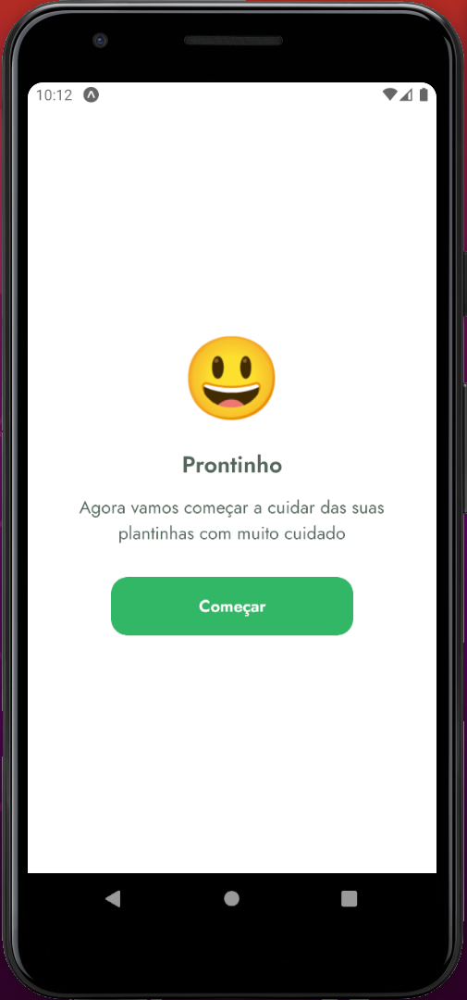
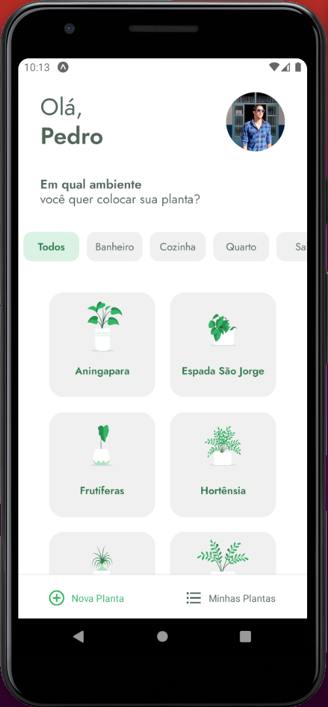
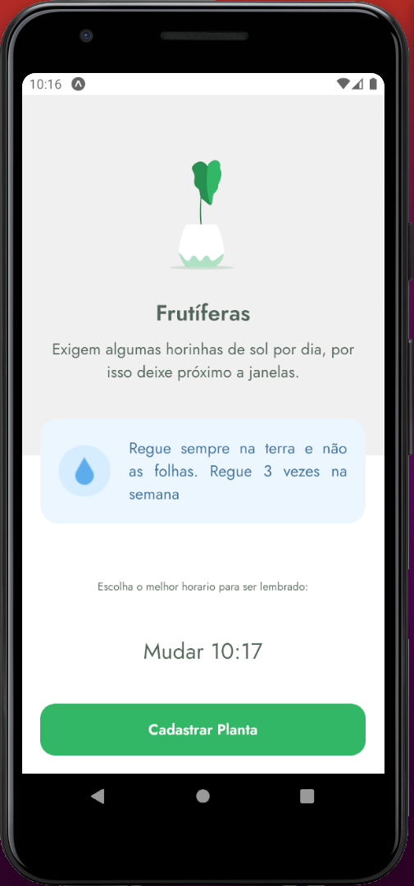
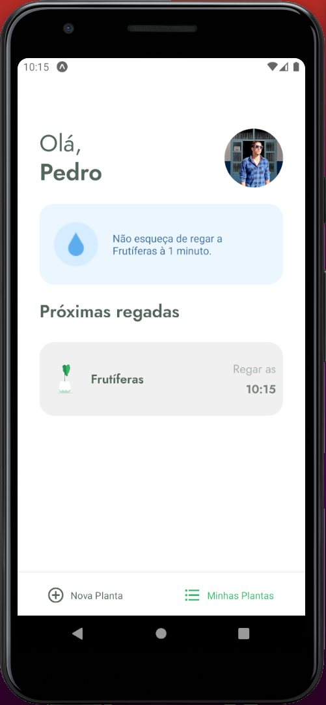
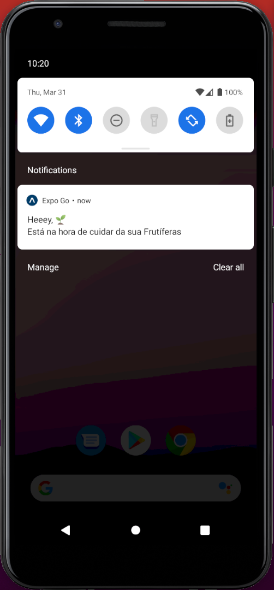

# PlantManager

<h1 align="center">PlantManager</h1>

## Descrição do Projeto

Aplicação desenvolvida em busca de ajudar as pessoas a cuidarem de suas plantinhas,
                muitas pessoas tem plantas em casa e esquecem de regar as suas plantinhas, o app ajuda as pessoas a lembrem das suas plantinhas,
                o diferencial do app é que ele traz algumas informações e dicas que ajudam os usuarios a conhecerem as plantas,
                por exemplo quanto tempo a planta precisa de luz e de quanto em quanto tempo deve ser regada.

  
  <!--ts-->
   * [Features](#features)
   * [Tecnologias](#tecnologias)
   * [Rodando a Aplicação](#Rodando a aplicação)
   * [Autor](#autor)
<!--te-->

<a href="https://reactnative.dev/">🔗 React Native</a>
<a href="https://expo.dev/">🔗 Expo</a>
<a href="https://pt-br.reactjs.org/">🔗 React</a>
<a href="https://nodejs.org/en/">🔗 NodeJs</a>
<a href="https://www.npmjs.com/">🔗 NPM</a>

🚀 lib para construir interfaces do usuário com componentes reutilizáveis

 

<h4 align="center"> 
    🚧  React Native Select 🚀 concluído...  🚧
 </h4>
 
  ### Features

- [x] Cadastro de horário
- [x] Cadastro nome do usuário
- [x] Armazenamento nome do usuário, plantas adicionadas e horário para regar 
- [x] Notificação

<h1 align="left">
  
  
  
</h1>
<h1 align="left">
  
  
  
</h1>
<h1 align="left">
  
  
</h1>

### Tecnologias 
As seguintes ferramentas foram usadas na construção do projeto:

- [Expo](https://expo.io/)
- [React](https://pt-br.reactjs.org/)
- [React Native](https://reactnative.dev/)
- [TypeScript](https://www.typescriptlang.org/)

## 🚀 Como executar o projeto
💡o Projeto precisa que uma api facke esteja sendo executado para funcionar (utilizo da lib json-server).

### Pré-requisitos
Antes de começar, você vai precisar ter instalado em sua máquina as seguintes ferramentas:
[Expo](https://expo.io/). 
Além disto é bom ter um editor para trabalhar com o código como [VSCode](https://code.visualstudio.com/)

#### Rodando a aplicação

# Clone este repositório
$ git clone https://github.com/PedroTavolaro/PlantManager.git

# Acesse a pasta do projeto no seu terminal/cmd
$ cd PlantManager

# Instale as dependências
$ npm install ou yarn install
$ veja o arquivo https://github.com/PedroTavolaro/PlantManager/blob/main/package.json e instale suas dependências

  # instalar dependencia global na maquina 
  $ npm install -g json-server
  
  # Verifique a pasta ./src/services/api.ts
  $ verifique a linha 4 baseURL: 'http://192.168.1.10:3333' subistitua por 'http://IPDASUAMAQUINA:PORTA' assim alocando o ip da sua maquina e a porta       disponivel para uso. padrão (3333)
  
  # rodar o simulador de api
  $ json-server ./src/services/server.json --host 192.168.1.4 (subistituir pelo seu ip) --port 3333 (porta padrao)

# Execute a aplicação
$ expo start

# Acesse a aplicação apartir do emulador de androind / IOS ou do seu aparelho celular realizando o download do expoClient no PlayStore

## 📝 Licença
Este projeto esta sobe a licença [MIT](./LICENSE).

## 💪 Como contribuir para o projeto
1. Faça um **fork** do projeto.
2. Crie uma nova branch com as suas alterações: `git checkout -b my-feature`
3. Salve as alterações e crie uma mensagem de commit contando o que você fez: `git commit -m "feature: My new feature"`
4. Envie as suas alterações: `git push origin my-feature`
> Caso tenha alguma dúvida confira este [guia de como contribuir no GitHub](./CONTRIBUTING.md)

### Autor
---

<a href="https://pedrotavolaro.com">
 
  
 <b>PedroTavolaro</b></a> <a href="https://www.pedrotavolaro.ccom" title="PedroTavolaro">🚀</a>

Feito com ❤️ por Pedro Tavolaro 👋🏽 Entre em contato!

  

  

